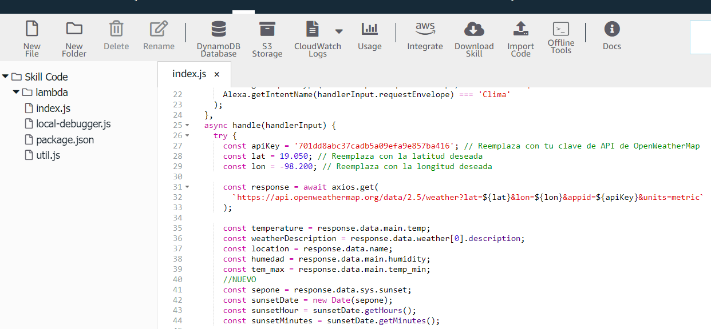

# Alexa_Skill_23083
Practica de la materia desarrollo móvil , para crear una skill de Alexa del clima

### AUTOR
ELABORADO POR BRAYAN GUTIERREZ RAMIREZ [@BrayanG02](https://github.com/BrayanG02)

    
    

     

| **Nombre del estudiante** | Brayan Gutiérrez Ramírez |
|:-------------------------:|:------------------------------:|
| **Matrícula**             | 230893                         |
| **Carrera**               | Ingeniería en Desarrollo y Gestión de Software |

# PRACTICA ALEXA SKILL DE CLIMA
## OBJETIVO
Desarrollar una skill para Alexa que permita a los usuarios obtener información meteorológica precisa y personalizada en tiempo real, utilizando su ubicación actual o una ubicación seleccionada.

# RESULTADO DE LA PRÁCTICA
1.  
- Para comenzar debemos crear una cuenta de Amazon Developer o iniciar sesion si ya tienes una cuenta.
2.  
- Descargamos herramientas necesarias, por si usas una plantilla o frameworks como ASK CLI (Alexa Skills Kit Command Line Interface), eh instálalos localmente.
3.  
- Definimos como se llamara y como interactuara con el usuario.
4.  
- Creamos una nueva skill, definiendo el propósito de la skill, determinando qué función cumplirá y cómo interactuarán los usuarios con comandos de voz.
5.  
- En la parte superior haz click en Code para editar el codigo.
6.  
- Ahi mismo haz click en Import Code y importa el que descargaste y procede a editar el codigo de acuerdo a tus necesidades, como el mensaje inicial, tus cordenadas y tu API de OpenWeatherMap.
7.  
- Despues de editar tu codigo, siempre debes dar click en Save despues en Deploy para al final poder construirla dando click en Build.
8.  
- En la misma parte superior haz click en Distribution para la agregacion de comentarios de la skill y su privacidad .
9.  
- Procedemos a construirla dando click en Build en la parte superior, para asi poder hacer pruebas.
10.  
- En la parte superior haz click en Test, coloca Alexa, Abre acompañado del nombre de tu skill. Para culminar, realiza una pregunta para poder interactuar con tu Skill de Alexa que haz realizado.
11.  
- Como resultado final nos arroja la información del clima

